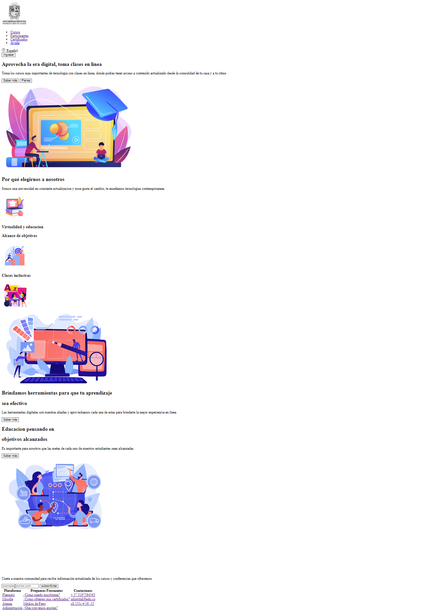
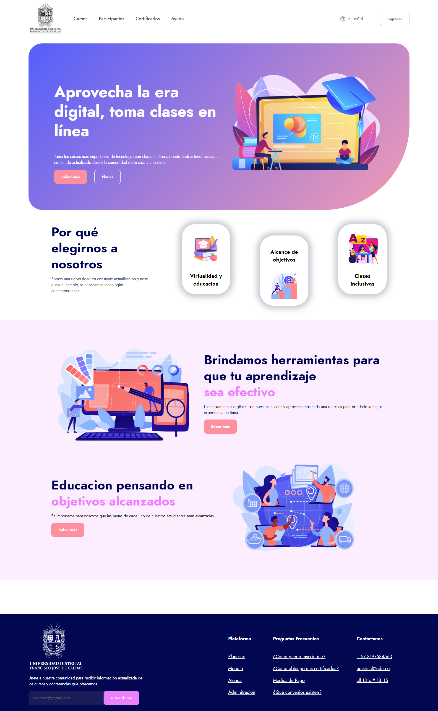
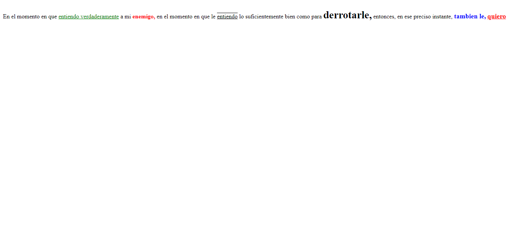
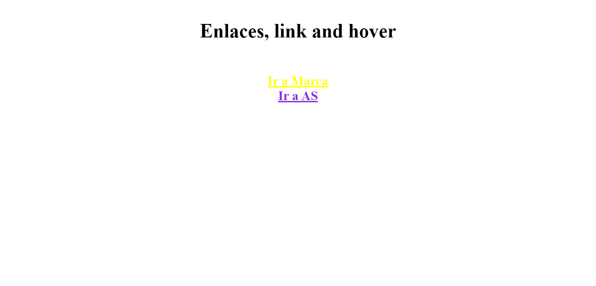

<h1>Taller 9 - Camilo Andrés Mora Acosta</h1>

<h2>Informacion</h2>

Curso: Full Stack Basico - Grupo 1

Profesor: Cristian Patiño

<h2>Link de la Pagina Web</h2>
<a href="https://kmilomora.github.io/taller-9-full-stack/">Link de Pagina Web</a>

<h2>Punto 1: Link de Figma</h2>
<a href="https://www.figma.com/file/KpAUBssfnHkK2YQRaQD9Kz/Camilo-Andr%C3%A9s-Mora-Acosta?type=design&node-id=0-1&mode=design&t=rkP1Q5kFxzALGFFM-0">Link de Figma</a>

<h2>Punto 2: Diseño de HTML</h2>

<h2>Punto 3: Diseño con CSS</h2>

<h2>Punto 4: Titulos</h2>

<h2>Punto 5: Parráfo</h2>

<h2>Punto 6: Links</h2>

<h2>Punto 7 y 8: Navegación</h2>

<h2>Punto 9: Tabla</h2>